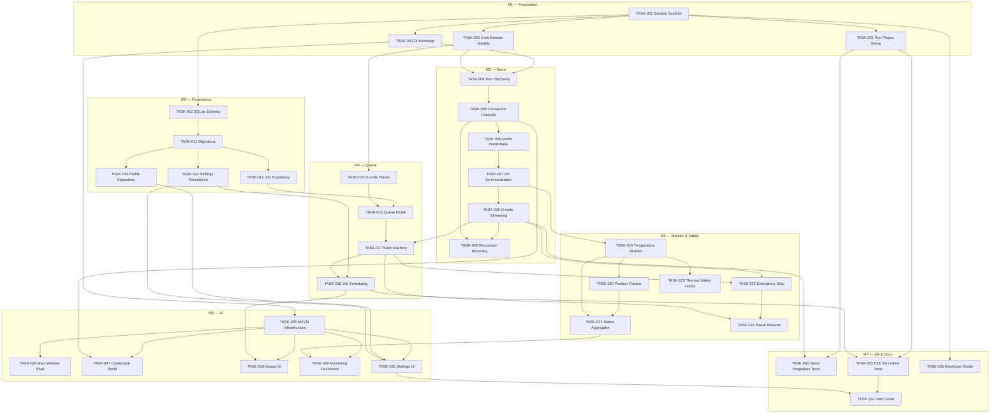

# Dependency Graph

Task dependency directed acyclic graph (DAG). A task may start only when all dependencies are **DONE**.

## Visual Overview



## Dependency Table

| Task | Depends On |
|------|------------|
| TASK-001 | — |
| TASK-002 | TASK-001 |
| TASK-003 | TASK-001 |
| TASK-004 | TASK-002, TASK-003 |
| TASK-005 | TASK-004 |
| TASK-006 | TASK-005 |
| TASK-007 | TASK-006 |
| TASK-008 | TASK-007 |
| TASK-009 | TASK-005, TASK-008 |
| TASK-010 | TASK-001 |
| TASK-011 | TASK-010 |
| TASK-012 | TASK-011 |
| TASK-013 | TASK-011 |
| TASK-014 | TASK-011 |
| TASK-015 | TASK-002 |
| TASK-016 | TASK-015, TASK-012 |
| TASK-017 | TASK-016, TASK-008 |
| TASK-018 | TASK-017, TASK-014 |
| TASK-019 | TASK-007 |
| TASK-020 | TASK-019 |
| TASK-021 | TASK-019, TASK-020 |
| TASK-022 | TASK-008, TASK-017 |
| TASK-023 | TASK-019 |
| TASK-024 | TASK-017, TASK-022 |
| TASK-025 | TASK-003 |
| TASK-026 | TASK-025 |
| TASK-027 | TASK-005, TASK-025 |
| TASK-028 | TASK-018, TASK-025 |
| TASK-029 | TASK-021, TASK-025 |
| TASK-030 | TASK-014, TASK-013, TASK-025 |
| TASK-031 | TASK-001 |
| TASK-032 | TASK-008, TASK-031 |
| TASK-033 | TASK-018, TASK-031 |
| TASK-034 | TASK-030, TASK-033 |
| TASK-035 | TASK-001 |

## Critical Path

```text
TASK-001 → TASK-002 → TASK-004 → TASK-005 → TASK-006 → TASK-007 → TASK-008 → TASK-017 → TASK-018 → TASK-033 → TASK-034
```

**Estimated critical path duration:** ~120–160 hours (sequential agent work).

## Parallel Work Streams

After TASK-001 completes, these streams can proceed in parallel:

| Stream | Tasks | Owner Focus |
|--------|-------|-------------|
| A — Serial | TASK-002 → 004–009 | SerialEngineer |
| B — Persistence | TASK-010 → 011–014 | DatabaseEngineer, PersistenceEngineer |
| C — Queue prep | TASK-015 (after TASK-002) | QueueEngineer |
| D — Test infra | TASK-031 | TestEngineer |
| E — UI prep | TASK-025 (after TASK-003) | UIEngineer |

## Ready to Start (Initial)

These tasks have **no dependencies** and are available immediately after project initialization:

- TASK-001 — Solution scaffold
- TASK-010 — SQLite schema design (after TASK-001; blocked until implementation gate opens)

**Note:** All tasks remain TODO until implementation phase begins. TASK-001 is the first implementation task.

## State Recovery

To find available work:

1. List task IDs in `/progress/TODO.md`
2. For each, verify all dependencies appear in `/progress/DONE.md`
3. Pick highest-priority eligible task
4. Move to IN_PROGRESS per workflow rules
